<h1>B5.🚀로켓단🚀 -  🐶펫소 (PetSo)🐱</h1>
<h3>팀 명 :  🚀로켓단🚀</h3>
<h3>프로젝트 명 :  🐶펫소 (PetSo)🐱</h3>

 

---

 

- 프로젝트 설명 :
  - 대표적인 반려동물 강아지와 고양이들을 키우는 집사들의 도움 커뮤니티
  - 한국지능정보사회진흥원이 운영하는 AIhub에서 제공하는 반려동물 피부 질환 이미지 데이터를 전처리한 후 YOLOv5의 모델 중 하나인 yolov5n모델에 훈련시켜 미란, 결절 증상을 탐지하도록 학습, 일반 사용자들이 쉽게 판단하기 어려운 피부 질환들을 예측하여 알려주고, 사용자 주변의 병원들을 추천해주는 서비스 제공
- 서비스 목표(목적) :
  - 반려 동물이 진료가 필요할 때 주변 동물 병원을 쉽게 찾을 수 있게 도움을 주고, 나타내는 증상을 이미지로 검색하여 예상 병명을 빠르게 파악할 수 있는 서비스를 제공하며, 커뮤니티 게시판과 실시간 채팅 기능으로 반려 동물 케어 중 발생하는 문제 해결 방법과 일상 등을 공유하여 유저 간의 원활한 피드백 및 소통을 목적으로 하는 서비스입니다.

 

<h2>💻 기능 소개</h2>

- 사용자 (User)
  - 회원가입 / 로그인
  - 프로필
  - 팔로우 기능
  - 소셜 로그인 서비스
  
- 반려동물 (Pet)
  - 내 반려동물 등록
  - 사용자가 입력한 이미지를 사용해 반려동물의 피부 질환 사물인식 모델을 활용해 탐지
    - YOLOv5

- 게시글 (Article)
  - 반려동물 게시판(이미지 업로드)
  - 반려 물품 추천 및 후기
  - 질병 공유하기(이미지 업로드)
  - 댓글
  - 좋아요, 북마크

- 그 외 서비스
  - 동물 병원 지도
  - 실시간 채팅방 

 

<h2>📋ERD</h2>
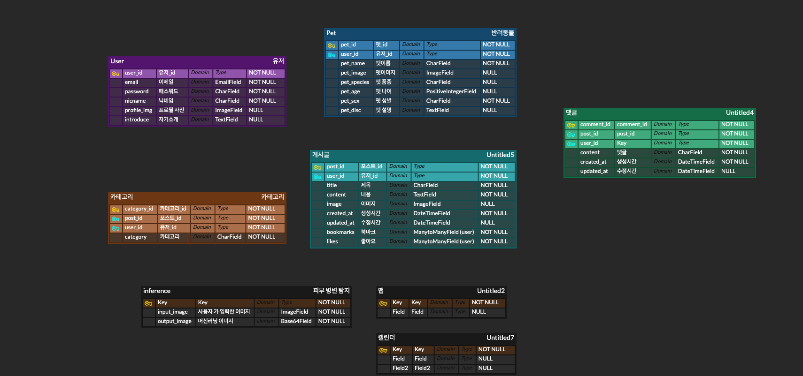

 

<h2>🌄 와이어프레임</h2>
1. 회원가입
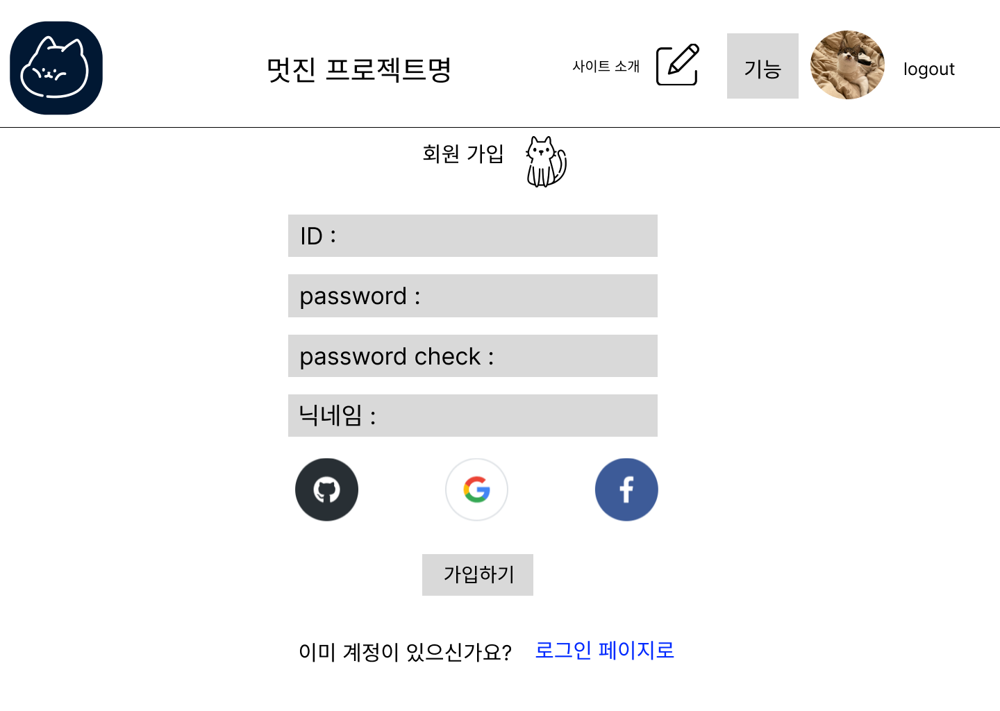
2. 로그인
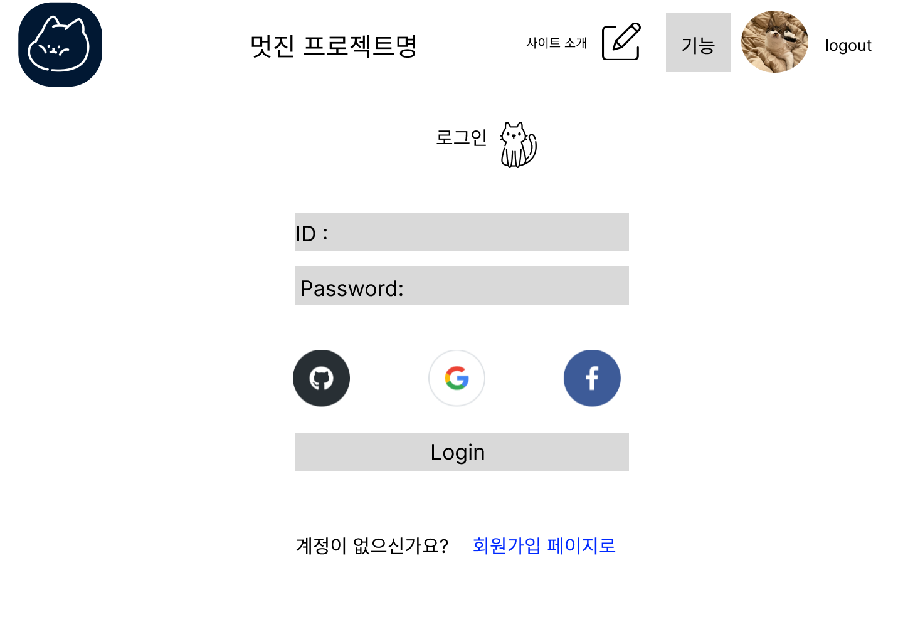
3. 개인프로필
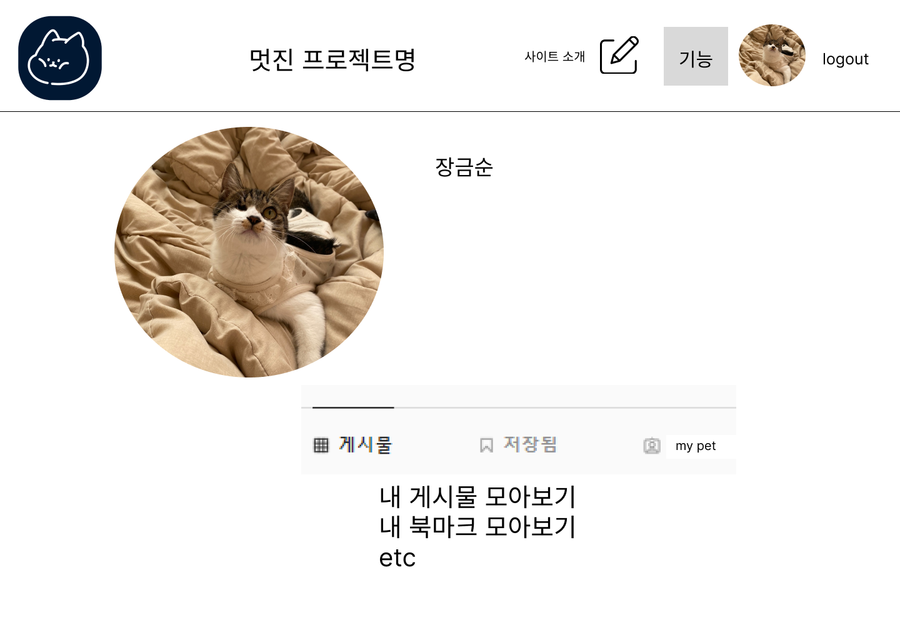
4. 펫 프로필
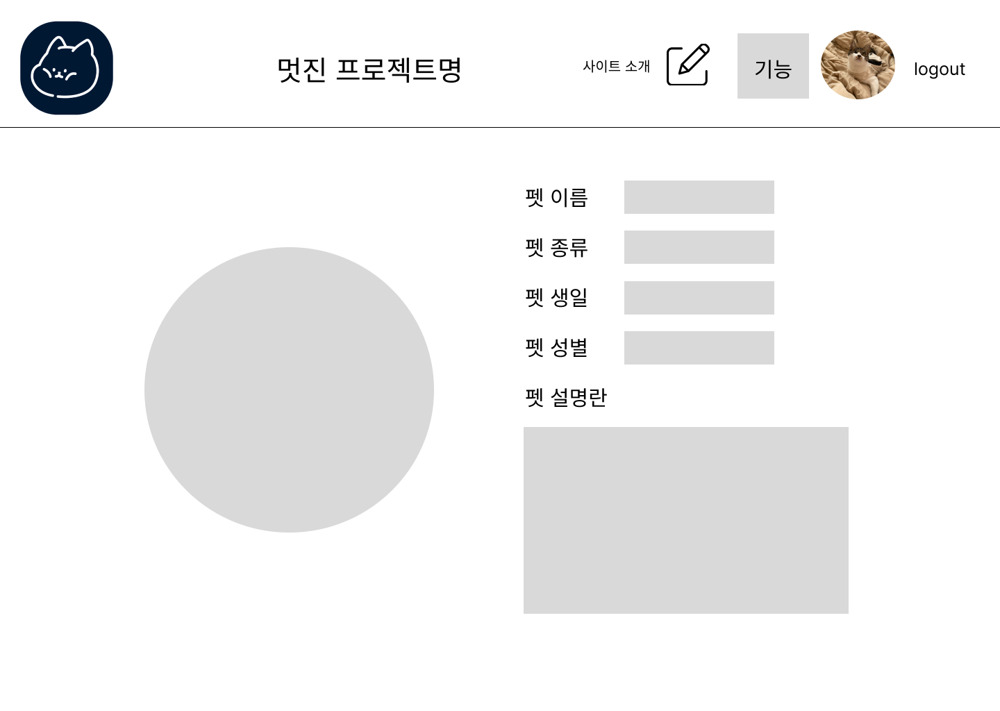
5. 프로필 수정
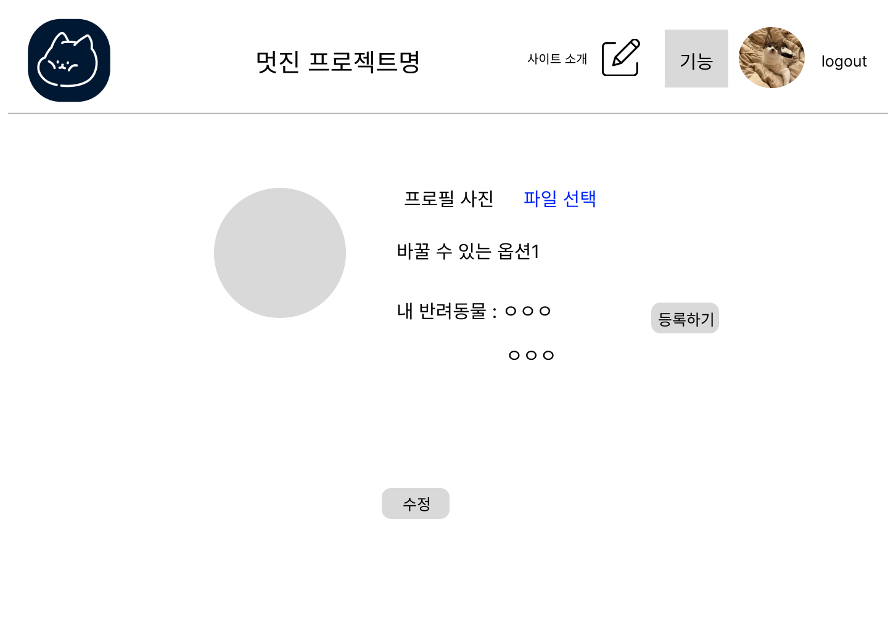
6. 메인페이지
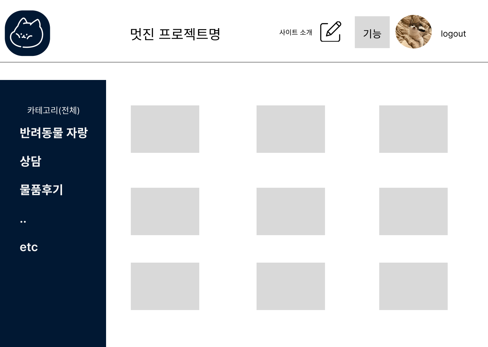
7. 게시글 상세
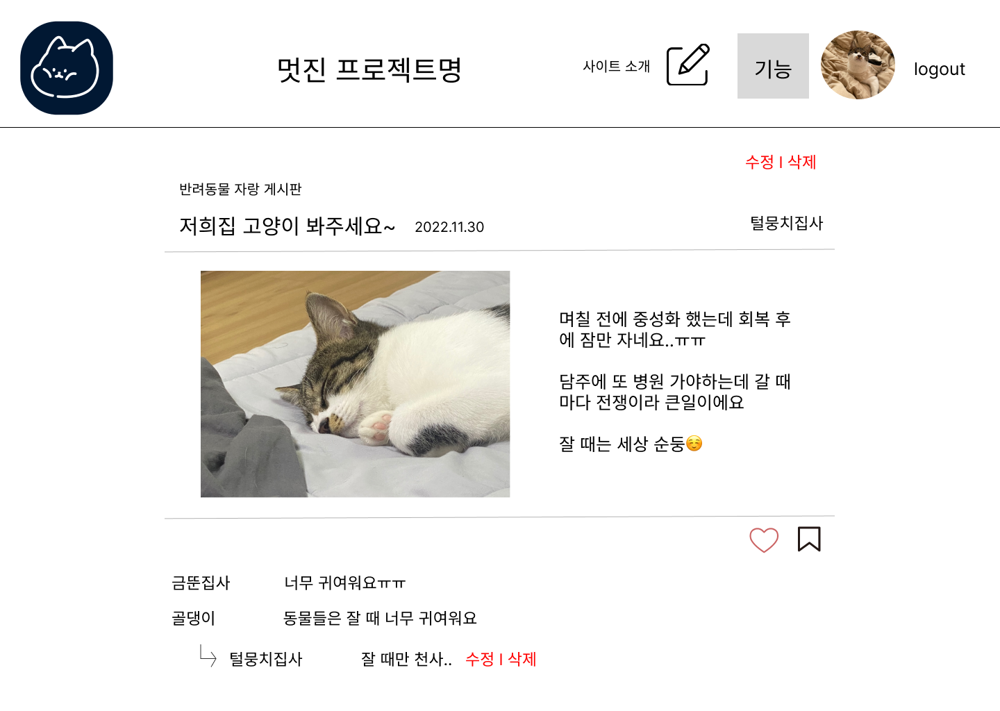
8. 게시글 수정
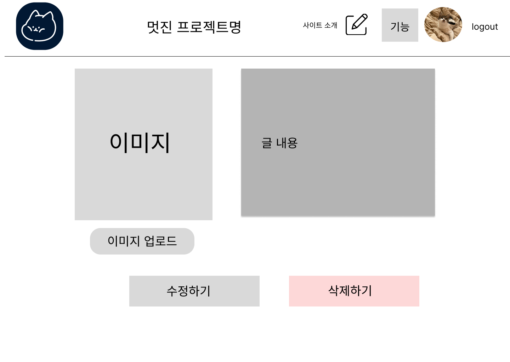
9. 반려동물 병변 검사
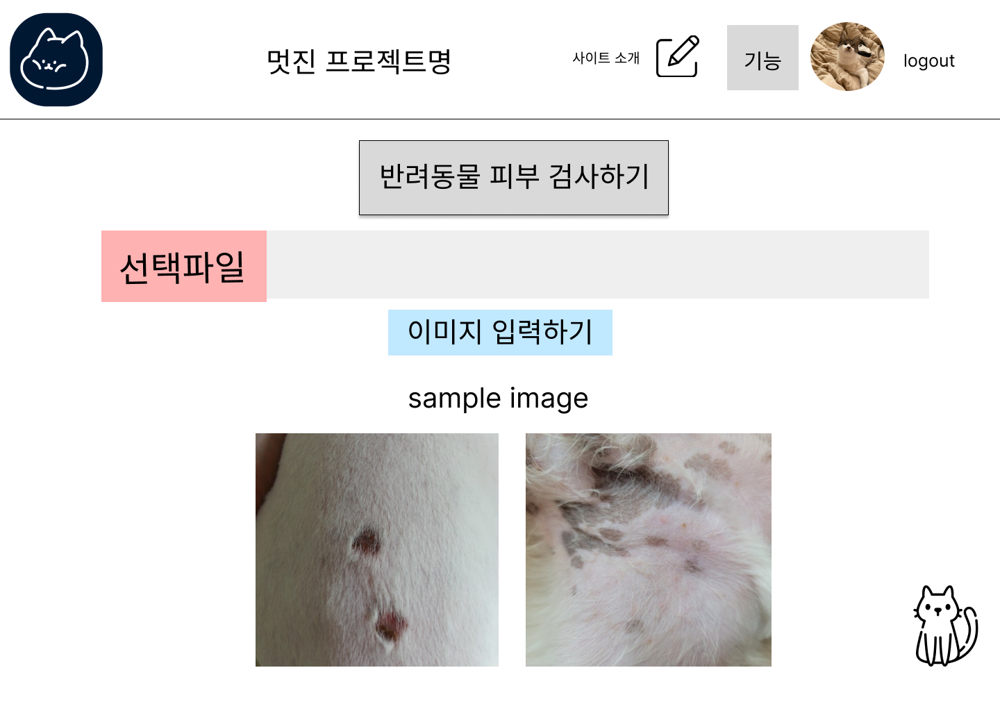
10. 반려동물 병변 결과
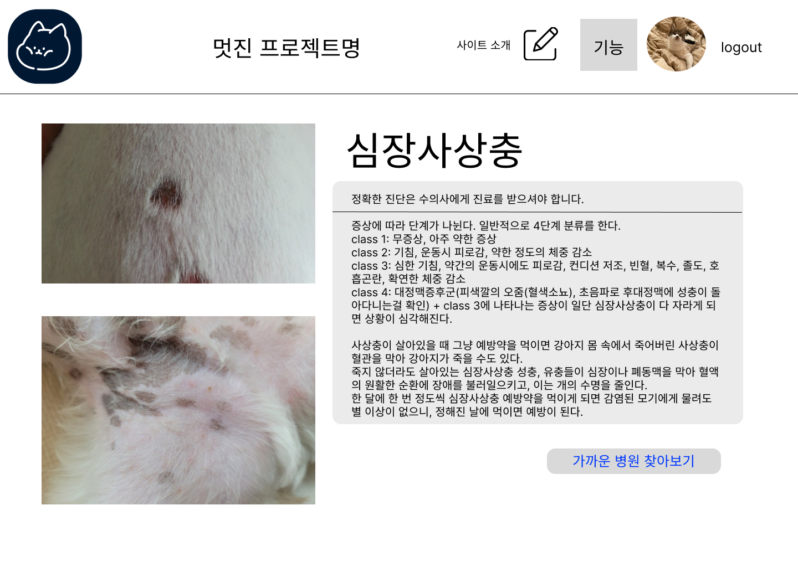
11. 실시간 채팅 페이지
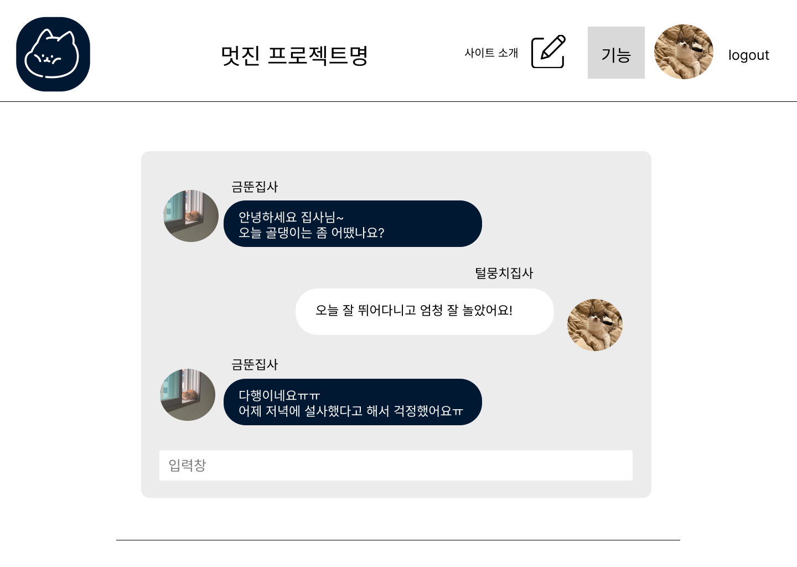
12. 주변 동물병원 지도
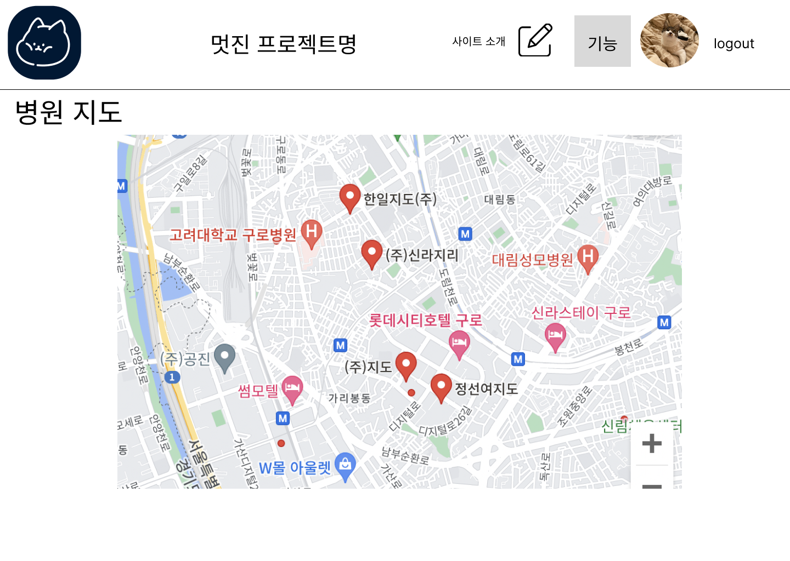

 

<h2>📜 API설계</h2>
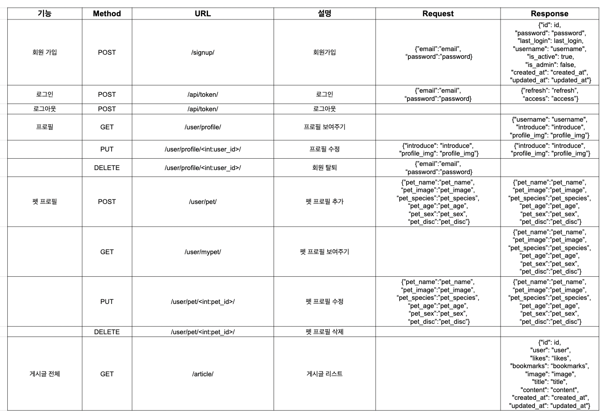
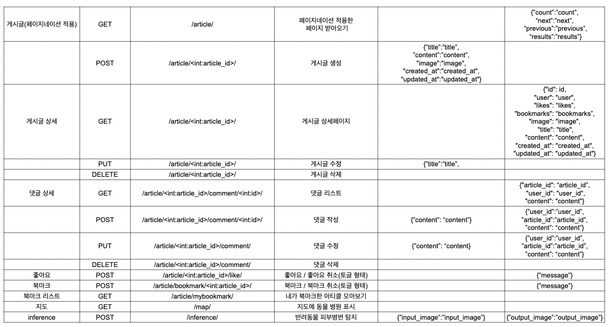